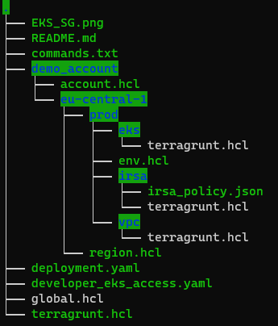
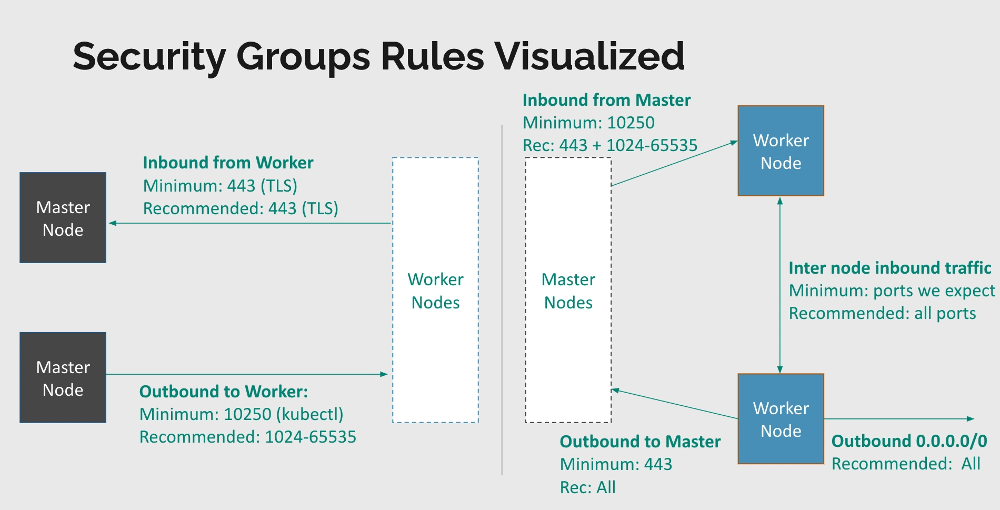

# How to deploy Terraform&Terragrunt IaC code files

## Requirements

- [`terraform`](https://learn.hashicorp.com/tutorials/terraform/install-cli)
- [`terragrunt`](https://terragrunt.gruntwork.io/docs/getting-started/install/)
- [`aws-cli`](https://docs.aws.amazon.com/cli/latest/userguide/getting-started-install.html)
- [`kubectl`](https://docs.aws.amazon.com/eks/latest/userguide/install-kubectl.html)


### The code structure will be like as following



* `demo_account` - Name of our AWS account. You can add the same level to your other AWS accounts.
    * `account.hcl` - This file contains of account based variables
    * `eu-central-1` - This folder contains of region  based environment folder structure. 
      * `region.hcl` - This file contains of region based variables
      * `prod` - This folder contains of environment based module configuration folders
        * `env.hcl` - This file contains of environment based variables
        * `eks`, `irsa`, `vpc`  - **terragrunt.hcl** file for each of these folders defines module source with the same as folders itselfs and overrides variables like as inputs to these modules
* `terragrunt.hcl` - This file is a root config file for `Terragrunt` and contains of global configuration like `backend`, `provider` and so on.
* `global.hcl` - This file is a root global file for `Terragrunt` and contains of global name and tags.


# EKS cluster Secruity Groups Rules Visualized



# Info
Let's imagine we have an AWS account, in my case, I am using "demo_account" and we have  AWS programmatic access to the account.

These terragrunt files will deploy VPC, EKS, and IRSA with S3 access.
Resources will be provisioned by terragrunt in the "demo_account" account in "eu-central-1" region and for the "prod" environment. 
## How to apply terragrunt 

VPC, EKS, and IRSA can be deployed via ```terragrunt``` commands.
Clone [`eks-terragrunt`](https://github.com/rustamsariyev/eks-terragrunt) then go to "eks-terragrunt/demo_account/eu-central-1/prod" and apply in the below command.

``` 
terragrunt run-all apply 
```

# Configures kubectl so that you can connect to an Amazon EKS cluster.  SSO login with Admin role
```
aws eks update-kubeconfig --region eu-central-1 --name webapp-prod --alias webapp-prod-admin
```
# Deploy
```
kubectl apply -f deployment.yaml
kubectl apply -f developer_eks_access.yaml
```
# Configures kubectl so that you can connect to an Amazon EKS cluster. SSO login with developer role
```
aws eks update-kubeconfig --region eu-central-1 --name webapp-prod --alias webapp-prod-dev
```
# Test developer user permissions
```
kubectl get pods or kubectl auth can-i create pods
kubectl get deployments.apps  or  kubectl auth can-i create deployments
```
# Select developer namespace
```
kubectl get pods -n developer-ns  or  kubectl auth can-i create pods -n developer-ns
kubectl get deployments.apps -n developer-ns  or kubectl auth can-i create deployments -n developer-ns
```
# Check s3 access
```               pod_name
kubectl exec developer-deployment-55697b8dc6-lr5w9  -n developer-ns -- aws s3 ls
```